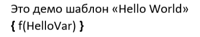
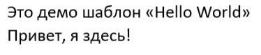

# Прмиер "Hello World" 

В этом примере показан простой вывод переменной из приложения в отчет.

## Шаблон отчета

Откройте приложение MS Word. Наберите статичный текст. Перейдите в режим отображения кодов полей нажатием комбинации клавиш `Alt + F9`. Хатем нажатием сочетания клавиш `Ctrl + F9` добавьте поле. Внутри кода поля укажите функцию вывода `f` в качестве параметра укажите переменную `HelloVar`.



Сохраните шаблон в формате RTF в папку `HelloWorld` под именем `HelloWorld.rtf`

## Заполнение отчета

Перейдите в редактор кода VBA. Предполагается, что у Вас в проект уже импортирован модуль `KRNReprt`. Создайте модуль для теста и добавьте в него процедуру:

```vb
Sub HelloWorld()
PrintReport ".\HelloWorld\HelloWorld.rtf", BuildParam(Nothing, "HelloVar", "Привет, я здесь!")
End Sub
```

Запустите код на исполнение. Вы должны получить заполненный шаблон. При этом вместо поля будет выведен текст указанный при построении отчета.


## Результат



