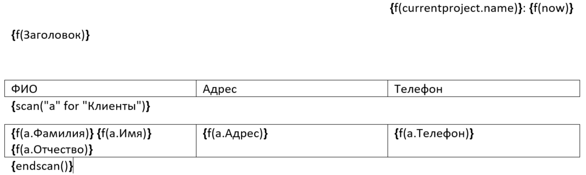

# Пример быстрого старта

В данном примере используется база данных `Платежи.accdb`. В проекте уже установлен модуль `KRNReport`, если Вы пробует создать в новой БД, то Вам нужно его [установить](../../README.md#install). 

В отчете отображаются данные из таблицы `Клиенты`. Шаблон очета сохраняется в файле "QuickStart.rtf". Имя шаблона затем необходимо будет передать при построении отчета.

## Шаблон отчета

Откройте текстовый редактор MS Word. Шаблон отчета содержит поля, которые добавляются нажатием сочетания клавиш CTRL + F9. Нажмите сочетание клавиш Alt+F9 для того что бы переключаться между режимами отображения кодов полей. 

Что бы однозначно отличать поля отчета от других полей, для RTFReport поля имеют формат `УправляющаяКонструкция(Параметр1;Параметр2...)`. С полным [списком управляющих инструкций](../../README.md#instruction) можно ознакомиться в основной части справки. 

Для вывода поля в отчет используется инструкця [`f`](../../README.md#instruction_f). Например, что бы вывести текущую дату и время запишите в поле `f(now)`, а что бы вывести имя текущей БД: `f(CurrentProject.Name)`. Таким же образом выводятся [переменная](../../README.md#BuildParam) `Заголовок`, задаваемая при построении отчета. 

Поля `scan("a" for "Клиенты")` `endscan()` - это [команды](../../README.md#instruction_scan) RTFReport. Поля внутри таблицы являются ссылками на поля таблицы `Клиенты`.



## Код для построения отчета

Добавьте на форму новую кнопку. Задайте ей обработчик нажатия.


Добавьте код запуска отчета в котором так же указано заполнение переменной `Заголовок`.

```vb
Private Sub QuickStart_Click()
  PrintReport _ 
    ".\QuckStart\QuickStart.rtf", _
    BuildParam(Nothing,"Заголовок","Это заголовок и он выводится как есть.")
End Sub
```

Перейдите в режим формы и запустите отчет. 

## Результат


