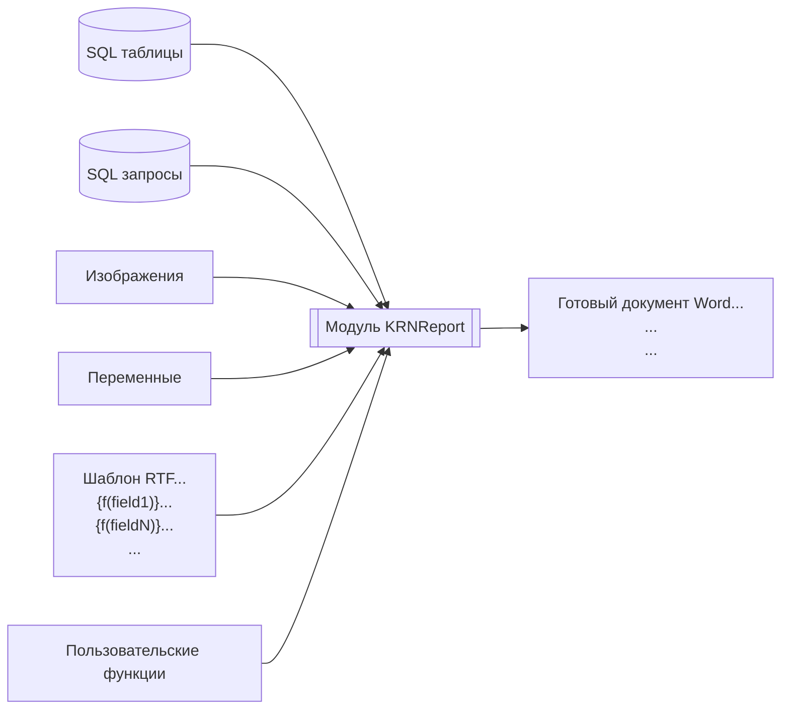
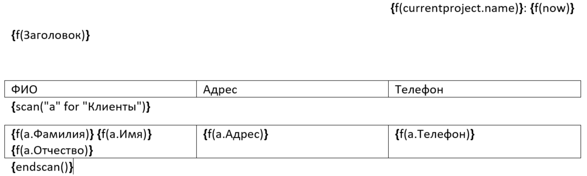
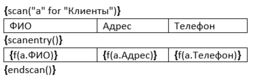
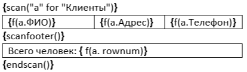

# Генератор отчетов в формате RTF 

Данный инструмент позволяет использовать все возможности MS Word для создания, предварительного просмотра, редактирования и печати отчетов, используя минимум кода. Если Вам понадобилось что, то исправлять в основном модуле, то скорее всего Вы делает что то не так.

Как это использовать:

- создайте шаблон отчета
- сохраните его в RTF 
- подготовьте данные в приложении
- выполните функцию [сгенерировать отчет](#runit)

Как это работает:


# Каталог примеров

[Пример "быстрый старт"](./Example/QuckStart/QuickStart.md)


# Создание шаблона отчета

Шаблон для отчета - это обычный документ RTF с включением управляющих инструкций-полей. Шаблон может быть создан визуально с помощью Word, OpenOffice или любого другого редактора документов.  Шаблон может включать форматированный текст, таблицы, изображения и т.д. 

В общем случае все поля данных и команды отчета размещаются среди текста отчета, таблиц и других объектов там, где вам это нужно (см. [пример "быстрый старт"](./Example/QuckStart/QuickStart.md)).

Все управляющие слова, переменные и поля данных должны располагаться внутри вычисляемых полей. В MS Word для отображения кодов полей нажмите сочетание клавиш `ALT+F9`, для добавления нового поля `Ctrl + F9`. 

В общем управляющие поля имеют формат `<Команда>(<Аргумент>)`. Если аргументов больше одного, то они отделяются символом `;` или `,`. У некоторых команд может не быть аргументов. Отдельные управляющие конструкции такие как [`IF`](#instruction_if), [`SCAN`](#instruction_scan) - парные и требуют соответствующих закрывающих команд.

Идентификаторы (поля и переменные) не должны содержать символы-разделители `(;,+-*/&^%<>= )`. Однако, если вы хотите использовать имя с пробелами или иными специальными символами, вы можете записать его между символами `[` и `]`, например: `{f(Form1.[Имя поля с пробелами])}`.

В дополнение к полям набора данных в отчете могут использоваться переменные. Для их добавления в локальный контекст используйте функцию [BuildParam](#BuildParam)

<a id="const"></a> В языке RTFReport существует несколько типов констант.

|Тип константы|Описание|
|----|----|
|Строка|Строковые константы определяются как последовательность символов обрамленных парой кавычек `"` или `'` или "\`", внутренние кавычки необходимо удвоить. Например `"Строковая константа"`, `'кавычки"другого типа" удваивать не нужно'`. Константы часто используются в качестве параметров для пользовательских функций|
|Дата|Константы даты всегда записываются в форме `#dd-mm-yyyy hh24:mi:ss#`, например `#20-07-2002#`
|Числовые|Числовые константы - это числа в десятичной или экспоненциальной форме: `2`, `2.5`, `3E-1`|
Логическое значение|Логические константы равны `True` или `False`
Null значение|Константа `Null`

Кроме того, Вы можете создавать [пользовательские функции](#UsrFnc) и [пользовательские итераторы](#UsrScan)

# <a id="instruction"></a> Инструкции.

1. <a id="instruction_f"></a> `{f(<Выражение>)}` Выводит [выражение](#expresion) в отчете. Опционально вторым параметром можно задать формат. В этом случае перед выводом в отчет значение выражение будет пропущено через функцию `format`. Более подробно с функцией format ознакомьтесь на сайте [Microsoft](https://learn.microsoft.com/ru-ru/office/vba/language/reference/user-interface-help/format-function-visual-basic-for-applications). Пример:

    ```
    {f(a.BoolenValue,';"Согласен";"Не согласен"')}
    {f(a.DateTimeValue,"hh:mi")}
    ```

2. <a id="instruction_scan"></a> `{Scan(Имя_курсора for Текст_запроса)} {EndScan()}`– Открывает новый набор данных и подготавливает его. Если набор будет пуст, то управление передается на позицию идущую за парной инструкцией `EndScan()`. `Имя_курсора` и `Текст_запроса` должны быть выражением или текстовым литералом заключенном в двойные кавычки. 

    Более подробно см. [отдельную часть](#AboutScan)

3. `{next(Имя_курсора)}` - Переместит курсор на одну строку вперед и обновит все переменные. Если весь курсор будет прочитан, то переменные полей запроса будут очищены (в отличии от обычного завершения по `EndScan`).

4. <a id="instruction_if"></a>`{If(<Выражение>)}… {elif (<Выражение>)}…{else()}…{endif()}` обычный оператор условия.

5. `{skip()} {endskip([skip_lf])}` Вырезают из шаблона часть, если у `endskip` указан параметр `skip_lf`, то он заберет с собой перевод строки


# <a id="expresion"></a> Выражения

В выражениях может использовать [константы](#const), [локальные переменные](#BuildParam), глобальные переменные, а так же функции. Параметры функций отделяются друг от друга символом `;` или `,`. Арифметические и логические операции те же самые, что и в построителе выражений VBA. Дополнительно доступны операторы `like` и `between`. 

## Встроенные функции

Функция|Синоним|Кол-во операндов|Результат|Описание
|---|---|---|---|---|
rel||1||Вычисляет строковое значение и возвращает значение переменной с таким именем
clr||1..16||удаляет из контекста переменные
sum||2..16 (кратно 2)||Добавляет к переменной с именем заданном в первом параметре, значение из второго. Всего может быть задано до 8 пар 
inc||1..16||Увеличивает значение параметра на 1 
cts||2..16 (кратно 2)||Увеличивает значение переменной с именем заданном в первом параметре, на 1 если значение второго параметра не пустое. Всего может быть задано до 8 пар 
calc|set|2||Вычисляет оба параметра и присваивает переменной с именем первого параметра значение второго параметра, и возвращается имя переменной. Внимание! Set здесь имеет иное значение чем в VBA и является аналогом простого присваивания.
open||имя_файла\[;кодировка\]|Byte()  или Строка|Открывает указанный файл. Если кодировка не указана, то файл открывается как бинарный и результат можно использовать для вставки изображения по имени файла. Если имя файла начинается с ".\", то в начало подставляется имя папки в которой размещена БД. Кодировки: utf-8, windows-1251
rtfimg||бинарный_файл; ширина; высота|Rtf блок|Функция возвращает rtf блок, данные передаются как сырые данные файла byte(). Данные можно получить из поля OLE с бинарными данными или функцией open. Вторым и третьим параметром передается соответственно ширина и высота рисунка в миллиметрах
attach||Имя_поля; Маска||Извлекает файл из поля с типом Attachment Функция имеет второй параметр где указывается маска файла в формате RegExp. По умолчанию используется маска ".+\.(jpg\|jpeg\|png\|emf)$". Если маске соответствует несколько файлов выбирается первый. На данный момент эта единственная функция которая может работать с полями типа Attachments.
ean13||Текст_с_штрихкодом; Ширина; Высота|Rtf блок|Вставляет в документ картинку с штрихкодом в формате EAN13. Штрих код должен быть не больше 13 цифр, при этом крайняя правая цифра - это контрольная сумма
code128||Текст; Ширина; Высота|Rtf блок|Вставляет в документ картинку с штрихкодом в формате CODE128. Штрих код должен состоять только из букв английского алфавита и цифр. Контрольное число добавляется автоматически в конец.
qrcode||Текст; Ширина; Высота|Rtf блок|Вставляет в документ картинку c QR кодом от текста. Для поддержки данной функции необходимо дополнительно добавить модуль `mdQRCodegen.bas`

## <a id="UsrFnc"></a>Пользовательские функции

Если Функция не будет найдена в предопределенном наборе, будет предпринята попытка вызвать пользовательскую.

Пользовательская функция имеет следующий интерфейс


```vb
Public function MyFnс(pParamList, aArg)
 '#param pParamList – Словарь с окружением, содержит все переменные и объекты текущего шаблона. Вызови pParamList("a.b") что бы получить значение поля b курсора a
 '#param aArg – массив с аргументами. За раз можно передать не более 16 параметров
  On Error GoTo OnError:

 'Здесь Ваш код 
  MyFnс = aArg(0) + 1

  Exit Function
OnError:
  Dim errNumber, errSource, errDescription
  errNumber = Err.Number: errSource = Err.Source: errDescription = Err.Description
  On Error GoTo -1
  Err.Number = errNumber: Err.Source = errSource: Err.Description = errDescription
End function
```

Обратите внимание на обработку ошибок. Такой блок должен быть в каждой пользовательской функции, чтобы можно было корректно обработать ошибку выше. 

В отличии от нативных функций, пользовательские функции имеют доступ к контексту переменных. Если функция чистая, т.е. ее результат зависит только от входящих параметров и не оказывает влияния на контекст переменных, то рекомендуется использовать нативные функции.  

## Нативные функции

Встроенные функции VBA (нативные) доступные из построителя выражений SQL доступны под теми же именами. Нативные функции вызываются если имя функции не найдено в списке встроенных и не найдена пользовательская функция.

# <a id="AboutIf"></a>Оператор IF - ENDIF

Оператор имеет следующий формат

```
{if(<boolean value>)}
...
{elif(<boolean value>)}
...
{elif(<boolean value>)}
...
{else()}
...
{endif([skip_lf])}
```
где `<boolean value>` выражение возварщающее логическое значение. Может содержать переменные, поля и фнкции.

`endif` может содержать необязательный параметр `skip_lf`, при указании которого символ окончания параграфа после `endif` будет пропущен и не будет выведен в отчет. Символ окончания параграфа всегда пропускается после `if` и `elif`.


# <a id="AboutScan"></a> Конструкция Scan

Все записи набора данных могут быть вставлены в документ в виде строк таблицы или в любой свободной форме. Для этого используйте ключевые слова `{Scan(ИмяКурсора for ...)}` и `{Endscan()}`. Внутри цикла `scan`-`endscan` может быть расположен текстовый блок с полями данных, переменными и константами, например:



Открывает курсор с именем `а`, считывает результаты запроса и укладывает результат в переменную с именем `a.Фамилия`, `a.Имя` ... 

Строки со словами `Scan`, `Endscan` исключаются из итогового документа.

Полный формат блока сканирования:

```
{scan([NewPage ]Имя_Курсора for ...)}
...
{scanentry()}
...
{scanfooter()}
...
{endscan()}
```
Имя курсора будет использовано как префикс к результатам, полученным в ходе выборки. 

Опция `NewPage` заставляет начинать каждую запись сканируемого набора данных (кроме первой) с новой страницы.

`Scan` по умолчанию работает с наборами данных БД. Так же поддерживаются пользовательские итераторы, для этого после ключевого слова `for` (обязательно должно быть обрамлено пробелами, имя_курсора не должно содержать в себе последовательность символов ` for `) укажите ключевое слово using и далее класс итератора (см. [итераторы определяемые в программе](#UsrScan)) дальнейший формат записи определяется итератором.

Блоки `scanentry` и `scanfooter` не обязательные. 



Блок отчета между ключевыми словами `scan` и `scanentry` будет выведен вместе с первой запись. Обратите внимание на то, что генератор отчетов пропустит весь блок сканирования, если в отсканированном наборе данных нет записей.



Блок отчета между ключевыми словами `scanfooter` и `endscan` будет выведен вместе с последней строкой, что полезно для вывода колонтитула или итогов. Если в наборе данных нет записей то блок будет пропущен.

Блоки `scanentry` и `scanfooter` могут использоваться одновременно.  

ПРИМЕЧАНИЕ: Необходимо ввести ключевые слова `{scan(...)}`, `{scanentry()}` и `{endscan()}` с одинаковыми атрибутами формата. Это гарантирует, что атрибуты формата внутри блока scan-endscan будут корректными в выходном документе.

Если вы используете опцию `NewPage` и таблицу сразу после ключевого слова `Scan` в шаблоне отчета, имейте в виду, что в документе RTF перед таблицей должен быть хотя бы один абзац (пустая строка), в противном случае редактор RTF, такой как MS Word, игнорирует элемент управления "новая страница".

При редактировании шаблона отчета размещайте ключевые слова `{scan(...)}`, `{endscan()}` вне таблицы или в той же ячейке, чтобы предотвратить искажение структуры таблицы RTF.

## Итератор по набору данных

По умолчанию используется итератор по набору данных, если после ключевого слов `for` не указано ключевое слово `using`. 

Данный класс итератора ожидает после `for` выражение возвращающее текст содержащий метод получения набора данных. Это может быть:

- Имя таблицы. В этом случае будет просканирована вся таблица
- имя запроса. В этом случае так же будет просканирован весь запрос 
- Ссылка на набор данных на форме. Ссылка должна начинаться с специального символа `@` далее имя формы и при наличии имя подчиненной формы отделенной символом `.`. Например `@Контракты.подформаПлатежи`. В этом случае набор данных клонируется и сканируется начиная с первой записи
- Текст запроса. Начинается с `select`

В тексте запроса можно обращаться к переменным окружения, для этого вставьте переменную обрамив ее символами %.

**Пример:**
```
{scan("a" for "select * from MyTable where id = %id%")}
```

Такой подход необходим для создания отчетов с архитектурой Master-Detail 
 
```
{scan("Parent" for "select * from MyTable where id = %id%")}{scan("Child" for "select * from MyChildTable where idParent = %Parent.id%")}{endScan()}{endScan()}
```

для некоторых типов возможно указать формат: `%Имя_переменной; Формат%`

для создания критерия отбора необходимо использовать следующую подстановку `%Имя_поля_Фильтра; stdf:Имя_поля%` что означает примени параметр `Имя_поля_Фильтра` к полю `Имя_поля`. Для добавления параметра в окружение можно использовать функцию `BuildParam` совместно с [`GetFilter`](#GetFilter).

Дополнительно создаются переменные `Имя_Курсора.EOF` возвращающие `True` на последней строке запроса и `Имя_Курсора.rownum` содержащей номер текущей строки. После `endScan()` значения переменных не очищается и их можно использовать. Явного запрета на переиспользование имени курсора во вложенном цикле - нет, но вложенный цикл может затереть данные родительского цикла.

## Числовой итератор "NumberIteration"

Представляет собой аналог цикла `for` в VBA. Строка инициализации имеет следующий синтаксис: `from НачальноеЗначение to КонечноеЗначение step Шаг`. Часть Step необязательная.

```
{scan("i" for using numberIteration from 1 to 10 step 3))}
{f(i)}) - строка
{endscan()}
```

## <a id="UsrScan"></a> Итераторы определяемые в программе

Для использования пользовательских итераторов укажите их класс. Синтаксис оставшейся части определён в самом классе.

Для создания собственного итератора необходимо создать реализацию 4-х функций:

 - `Public Sub <ИмяКласса>_New(ByRef Container, ByVal sAlias, ByVal sParam, ByRef pDic)`

    Вызывается при старте цикла, передаются следующие параметры цикла: 

    1. Ссылка на словарь в котором можно хранить текущее состояние итератора. При создании в словаре сразу будет находится имя курсора (alias) и название класса итератора (name);
    2. Имя_курсора;
    3. Оставшаяся часть строки после ключевого слова `using`;

        Для разбора строки можно использовать следующие функции (i - номер текущей позиции разбираемого символа):

        - `GetPartFromFormula(sParam, i)` - Используется для получения литерала
        - `GetExpression(sParam, pDic, i)` - Разбирает в строке выражение и возвращает его значение

    4. Ссылка на локальный контекст.    

 - `Public Function <ИмяКласса>_EOF(ByRef Container, ByRef pDic)`

    Вызывается перед выводом каждой строки. Функция должна вернуть True если есть данные для выборки и false во всех остальных случаях

 - `Public Function <ИмяКласса>_Fetch(ByRef Container, ByRef pDic)`

    Функция должна перенести текущее значение в локальный контекст `pDic` при этом что бы не конфликтовать с другими итераторами необходимо использовать значение `Container("alias")`. Функция должна вернуть True, если операция выполнена успешно и False в противном случае.

 - `Public Sub <ИмяКласса>_Close(ByRef Container, ByRef pDic)`

    Функция вызывается при закрытии цикла. Здесь должен располагаться код с очисткой памяти.

Во всех 4-х функциях обработка ошибок должна производиться так же как и в [пользовательских функциях](#UsrFnc)

Пример реализации класса numberIteration см. в основном модуле `KRNReport`.


# Пример запуска отчета

Все переменные хранятся в объекте типа Dictionary поэтому его необходимо создать, а после завершения операции уничтожить. Если объект не уничтожить, то переменные созданные в первом отчете будут доступны и в последующих.

```vb
dim dic
Set dic = CreateObject("Scripting.Dictionary")
```
<a id="BuildParam"></a> Альтернативный вариант создания окружения это через функцию `BuildParam`. Первым параметром необходимо указать переменную с контекстом или `Nothing`, если нужно создать новый контекст. Дальше следует набор пар `Имя_параметра, Значение`. Количество не ограниченное.

```vb
dim dic
set dic = BuildParam(Nothing, "ID", 1, "Date", date() - 1)
```

Для создания критерия фильтра используйте функцию `GetFilter`. 

```vb
Function GetFilter(pParamName As String, pOperation As tOperationType, ParamArray pdata())
```

`pParamName` - Имя параметра. Префиксы параметров для `getFilter` жестко определяют, с какими типами данных работать: `s` – строки, `n` – число, `d` – дата. От них будет зависеть, как будет отформатирован запрос. 
`pOperation` - применяемая операция, перечень определен в перечислении `tOperationType`.

```vb
Public Enum tOperationType
  opEQ    = 1 ' равно
  opNEQ   = 2 ' не равно
  opGR    = 4 ' больше
  opLS    = 8 ' меньше
  opNLS   = 16 ' не меньше
  opNGR   = 32 ' не больше
  opIN    = 128 ' в списке
  opNIN   = 256 ' не в списке
  opcont  = 512 ' содержит
  opSTART = 1024 ' начинается
  opBTW   = 2048 ' между
  opBTWWL = 6144 ' между без левого
  opBTWWR = 10240 ' между без правого
  opBTWWB = 14336 ' между без обоих
  opNCont = 32768 ' не содержит
End Enum
```

Третьим и последующим параметром идут значения или 0 если критерий не применяется. Для многих операций должно быть только одно значение, для операций типа `opBTW`, `opBTWWL`, `opBTWWR`, `opBTWWB`  - два значения, для операций типа `opIN`, `opNIN` может быть много значений. 
Множество значений можно передавать массивом. Критерии фильтра можно перемежать с обычными параметрами.

<a id="GetFilter"></a>

```vb
dim dic
'Рассмотрим на примере {scan("a" for "select * from MyTable where true %nFilter; stdf:id%%sFilter; stdf:sName%"}, буду выводить только значение после where
set dic = BuildParam(Nothing, GetFilter("nFilter", opEQ, 1)) ' true and id = 1
... GetFilter("nFilter", opGR, 1) ' true and id > 1
... GetFilter("nFilter", opBTW, 1, 10) ' true and id between 1 and 10
... GetFilter("nFilter", opIn, 1, 2, 3) ' true and id in (1,2,3)
... GetFilter("nFilter", opNIn, array(1, 2, 3)) ' true and not id in (1,2,3)
... GetFilter("sFilter", opCont, "abc") ' true and sName like '%abc%'
... GetFilter("sFilter", opNCont, "abc"),  GetFilter("nFilter", opGR, 10) ' true and id > 1 and not sName like '%abc%'
```

<a id="runit"></a>Запуск формирования отчета

Запускает отчет с кодом 1

```vb
  PrintReport 1, dic 
  Set dic = Nothing
```

Запускает отчет из шаблона на диске, результат сохраняется так же на диске
```vb
  PrintReport _ 
    "d:\RTFReport\Template.rtf", _
    dic, _
    "d:\Complete\Report.rtf"  
  Set dic = Nothing
```

Запускает отчет без дополнительных переменных. Шаблон с именем "template" берется из внутреннего хранилища

```vb
  PrintReport "Template"
```