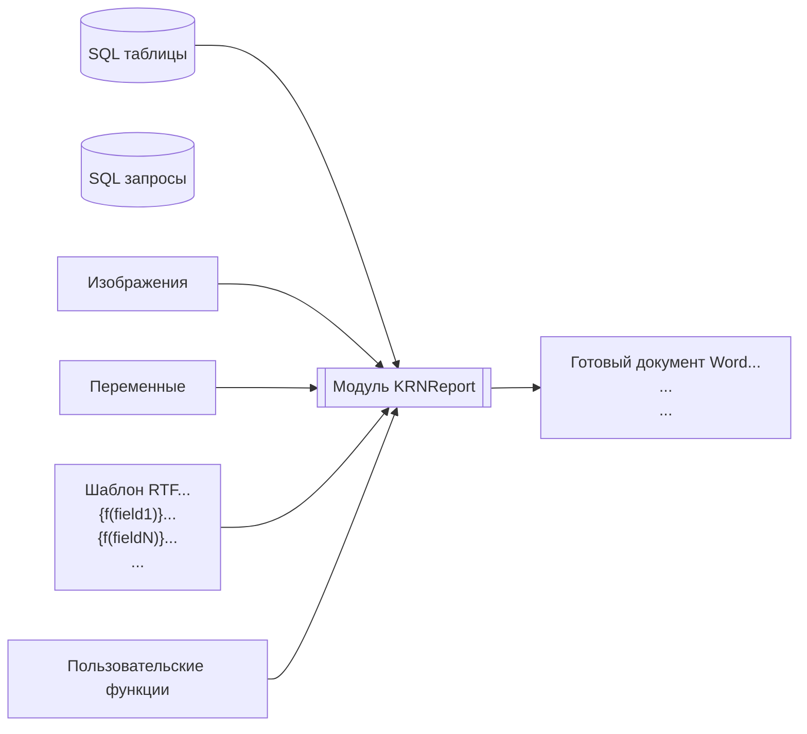

# Генератор отчетов в формате RTF 

Данный инструмент позволяет использовать все возможности MS Word для создания, предварительного просмотра, редактирования и печати отчетов, используя минимум кода. Если Вам понадобилось что то исправлять в основном модуле, то скрее всего Вы делает что то не так.

Как это использовать:

- создайте шаблон отчета
- сохраните его в RTF 
- подготовьте даннные в приложении
- выполните функцию [сгенерировать отчет](#runit)

Как это работает:


# Каталог примеров

[Пример "быстрый старт"](./example/QickStart/QuickStart.md)


# <a id="install"></a> Установка

Для установки в проект импортируйте файл `KRNReport.bas` ([особенности установки на Access97](#access97)). 

Перейдите в редактор Visual Basic и нажатием F5 вызовите окно запуска макросов. 

Запустите процедуру `InstallRepSystem`, что бы создать таблицу для хранения шаблонов. При необходимости сохранить отчет внутри БД запустите процедуру `InstallReportTemplate`, что бы добавить шаблон в хранилище. 

Подготовленные шаблоны хранятся в таблице `t_rep`. Большинство полей заполняются процедурой `InstallReportTemplate`.

Наименование столбца|Описание
|---|---|
sCaption|Название отчета. Может применяться в качестве параметра vReport функции PrintReport.
sDescription|Более подробное описание отчета (опиши зачем отчет нужен)
sOrignTemplate|Путь до шаблона. При первом построении отчета шаблон переведется во внутреннюю форму и сохранится в `clTemplate`. В дальнейшем он будет обновляться если дата изменения файла будет больше чем в поле `dEditTemplate`. После сохранения шаблона внешний файл больше не нужен
clTemplate|Скомпилированный шаблон RTF

Так же возможно построение отчета напрямую из файла шаблона, без сохранения в `t_rep`. Для этого при вызове функции `PrintReport` в параметре `vReport` необходимо передать не код шаблона в таблице `t_rep`, а путь до файла шаблона.
Данный метод не много медленнее, так как приходится каждый раз разбирать файл на части.

# Создание шаблона отчета

Шаблон для отчета - это обычный документ RTF с включением управляющих инструкций-полей. Шаблон может быть создан визуально с помощью Word, OpenOffice или любого другого редактора документов.  Шаблон может включать форматированный текст, таблицы, изображения и т.д. 


В общем случае все поля данных и команды отчета размещаются среди текста отчета, таблиц и других объектов там, где вам это нужно.

Все управляющие слова, переменные и поля данных должны распологаться внутри вычисляемых полей. В MS Word для отображения кодов полей нажмите сочетнание клавиш `ALT+F9`, для добавления нового поля `Ctrl + F9`. 

В общем управляющие поля имеют формат `<Команда>(<Аргумент>)`. Если оргументов больше одного, то они отделяются символом `;`. У некоторых команд может не быть аргументов. Отдельные управляющие конструкции такие как [`IF`](#instruction_if), [`SCAN`](#instruction_scan) - парные и требуют соответствующих закрывающих команд.

<a id="const"></a> В языке RTFReport существует несколько типов констант.

|Тип константы|Описание|
|----|----|
|Строка|Строковые константы определяются с помощью двойных кавычек, внутренние кавычки необходимо удвоить. Например `"Строковая константа"`. Константы часто используются в качестве параметров для пользовательских функций|
|Дата|Константы даты всегда записываются в форме `#dd-mm-yyyy hh24:mi:ss#`, например `#20-07-2002#`
|Числовые|Числовые константы - это числа в десятичной или экспоненциальной форме: `2`, `2.5`, `3E-1`|
Логическое значение|Логические константы равны `True` или `False`
Null значение|Константа `Null`


# <a id="instruction"></a> Инструкции.

5. <a id="instruction_f"></a> `{f(<Выражение>)}` Выводит [выражение](#expresion) в отчете

1. <a id="instruction_scan"></a> `{Scan(Имя_курсора for Текст_запроса)} {EndScan()}`– Открывает новый набор данных и подготавливает его. Если набор будет пуст, то управление передается на позицию идущую за парной инструкцией `EndScan()`. `Имя_курсора` и `Текст_запроса` должны быть выражением или текстовым литералом заключенном в двойные кавычки. 

    Имя курсора будет использовано как префикс к результатам полученным в ходе выборки.

    **Пример:** 
    ```
    {scan("a" for "select 1 as b from dual")} {f(a.b)} {endScan()}
    ```
    Открывает курсор с именем `а`, считывает результаты запроса и укладывает результат в переменную с именем `a.b`

    Дополнительно создаются переменные `Имя_Курсора.EOF` возвращающие `True` на последней строке запроса и `Имя_Курсора.rownum` содержащей номер текущей строки. После `endScan()` значения переменных не очищается и их можно использовать. Явного запрета на переиспользование имени курсора во вложенном цикле - нет, но вложенный цикл может затереть данные родительского цикла.

    В тексте запроса можно обращаться к переменным окружения, для этого вставьте переменную обрамив ее символами %.

    **Пример:**
    ```
    {scan("a" for "select * from MyTable where id = %id%")}
    ```
    или пример с вложенными запросами 
    ```
    {scan("Parent" for "select * from MyTable where id = %id%")}{scan("Child" for "select * from MyChildTable where idParent = %Parent.id%")}{endScan()}{endScan()}
    ```

    для некоторых типов возможно указать формат: `%Имя_переменной; Формат%`

    для создания критерия отбора необходимо использовать следующую подстановку `%Имя_поля_Фильтра; stdf:Имя_поля%` что означает примени параметр `Имя_поля_Фильтра` к полю `Имя_поля`. Для добавления параметра в окружение можно использовать функцию `BuildParam` совместно с `GetFilter`. См. примеры вызова ниже.

    

2. `{next(Имя_курсора)}` - Переместит курсор на одну строку вперед и обновит все перемнные. Если весь курсор будет прочитан, то перемнные полей запроса будут очищены (в отличии от обычного завершения по `EndScan`).

3. <a id="instruction_if"></a>`{If(<Выражение>)}… {elif (<Выражение>)}…{else()}…{endif()}` обычный оператор условия.

4. `{skip()} {endskip([skip_lf])}` Вырезают из шаблона часть, если у `endskip` указан параметр `skip_lf`, то он заберет с собой перевод строки


# <a id="expresion"></a> Выражения

В выражениях может использовать [константы](#const), [локальные переменные](#BuildParam), глобальные переменные а так же функции. Параметры функций отделяются друг от друга символом `;` или `,`. Арефметические и логические операции те же самые, что и в построителе выражаений VBA. 

## Встроенные функции

Функция|Синоним|Кол-во операндов|Результат|Описание
|---|---|---|---|---|
rel||1||Вычисляет строковое значение и возвращает значение переменной с таким именем
calc|set|2||Вычисляет оба параметра и присваивает переменной с именем первого параметра значение второго параметра, и возвращается имя переменной. Внимание Set здесь имеет иное значение чем в VBA и является аналогом простого присваивания.
open||имя_файла\[;кодировка\]|Byte()  или Строка|Открывает указанный файл. Если кодировка не указана, то файл открывается как бинарный и результат можно использовать для вставки изображения по имени файла. Если имя файла начинается с ".\", то в начало подставляется имя папки в которой размещена БД. Кодировки: utf-8, windows-1251
rtfimg||бинарный_файл; ширина; высота|Rtf блок|Функция возвращает rtf блок, данные передаются как сырые данные файла byte(). Данные можно получить из поля OLE с бинарными данными или функцией open. Вторым и третьим параметром передается соответственно ширина и высота рисунка в миллиметрах
attach||Имя_поля; Маска||Извлекает файл из поля с типом Attachment Функция имеет второй параметр где указывается маска файла в формате RegExp. По умолчанию используется маска ".+\.(jpg\|jpeg\|png\|emf)$". Если маске соответствует несколько файлов выбирается первый. На данный момент эта единственная функция которая может работать с полями типа Attachments.
ean13||Текст_с_штрихкодом; Ширина; Высота|Rtf блок|Вставляет в документ картинку с штрихкодом в формате EAN13. Штрих код должен быть не больше 13 цифр, при этом крайняя правая цифра - это контрольная сумма
code128||Текст; Ширина; Высота|Rtf блок|Вставляет в документ картинку с штрихкодом в формате CODE128. Штрих код должен состоять только из букв английского алфавита и цифр. Контрольное число добавляется автоматически в конец.
qrcode||Текст; Ширина; Высота|Rtf блок|Вставляет в документ картинку c QR кодом от текста. Для поддержки данной функции необходимо дополнительно добавить модуль `mdQRCodegen.bas`

## Пользовательские функции

Если Функция не будет найдена в предопределенном наборе, будет предпринята попытка вызвать пользовательскую.

Пользовательская функция имеет следующий интерфейс


```vb
Public function MyFnс(pParamList, aArg)
 '#param pParamList – Словарь с окружением, содержит все переменные и объекты текущего шаблона. Вызови pParamList("a.b") что бы получить значение поля b курсора a
 '#param aArg – массив с аргументами. За раз можно передать не более 16 параметров
  On Error GoTo OnError:

 'Здесь Ваш код 
  MyFnс = aArg(0) + 1

  Exit Function
OnError:
  Dim errNumber, errSource, errDescription
  errNumber = Err.Number: errSource = Err.Source: errDescription = Err.Description
  On Error GoTo -1
  Err.Number = errNumber: Err.Source = errSource: Err.Description = errDescription
End function
```

Обратите внимание на обработку ошибок. Такой блок должен быть в каждой пользовательской функции, что бы можно было корректно обработать ошибку выше.

## Нативные функции

Встроенные функции VBA (нативные) доступные из построителя выражений SQL доступны под теми же именами. Нативные функции вызываются если имя функции не найдено в списке встроенных и не найдена пользовательская функция 


# Пример запуска отчета

Все переменные хранятся в объекте типа Dictionary поэтому его необходимо создать, а после завершения операции уничтожить. Если объект не уничтожить, то переменные созданные в первом отчете будут доступны и в последующих.

```vb
dim dic
Set dic = CreateObject("Scripting.Dictionary")
```
<a id="BuildParam"></a> Альтернативный вариант создания окружения это через функцию `BuildParam`. Первым параметром необходимо указать переменную с контекстом или `Nothing`, если нужно создать новый контекст. Дальше следует набор пар `Имя_параметра, Значение`. Количество не ограниченное.

```vb
dim dic
set dic = BuildParam(Nothing, "ID", 1, "Date", date() - 1)
```

Для создания критерия фильтра используйте функцию `GetFilter`. 

```vb
Function GetFilter(pParamName As String, pOperation As tOperationType, ParamArray pdata())
```

`pParamName` - Имя параметра. Префиксы параметров для `getFilter` жестко определяют, с какими типами данных работать: `s` – строки, `n` – число, `d` – дата. От них будет зависеть, как будет отформатирован запрос. 
`pOperation` - применяемая операция, перечень определен в перечислении `tOperationType`.

```vb
Public Enum tOperationType
  opEQ    = 1 ' равно
  opNEQ   = 2 ' не равно
  opGR    = 4 ' больше
  opLS    = 8 ' меньше
  opNLS   = 16 ' не меньше
  opNGR   = 32 ' не больше
  opIN    = 128 ' в списке
  opNIN   = 256 ' не в списке
  opcont  = 512 ' содержит
  opSTART = 1024 ' начинается
  opBTW   = 2048 ' между
  opBTWWL = 6144 ' между без левого
  opBTWWR = 10240 ' между без правого
  opBTWWB = 14336 ' между без обоих
  opNCont = 32768 ' не содержит
End Enum
```

Третьим и последующим параметром идут значения или 0 если критерий не применяется. Для многих операций должно быть только одно значение, для операций типа `opBTW`, `opBTWWL`, `opBTWWR`, `opBTWWB`  - два значения, для операций типа `opIN`, `opNIN` может быть много значений. 
Множество значений можно передавать массивом. Критерии фильтра можно перемежать с обычными параметрами.

```vb
dim dic
'Рассмотрим на примере {scan("a" for "select * from MyTable where true %nFilter; stdf:id%%sFilter; stdf:sName%"}, буду выводить только значение после where
set dic = BuildParam(Nothing, GetFilter("nFilter", opEQ, 1)) ' true and id = 1
... GetFilter("nFilter", opGR, 1) ' true and id > 1
... GetFilter("nFilter", opBTW, 1, 10) ' true and id between 1 and 10
... GetFilter("nFilter", opIn, 1, 2, 3) ' true and id in (1,2,3)
... GetFilter("nFilter", opNIn, array(1, 2, 3)) ' true and not id in (1,2,3)
... GetFilter("sFilter", opCont, "abc") ' true and sName like '%abc%'
... GetFilter("sFilter", opNCont, "abc"),  GetFilter("nFilter", opGR, 10) ' true and id > 1 and not sName like '%abc%'
```

<a id="runit"></a>Запуск формирования отчета

Запускает отчет с кодом 1

```vb
  PrintReport 1, dic 
  Set dic = Nothing
```

Запускает отчет из шаблона на диске, результат сохраняется так же на диске
```vb
  PrintReport _ 
    "d:\RTFReport\Template.rtf", _
    dic, _
    "d:\Complete\Report.rtf"  
  Set dic = Nothing
```

Запускает отчет без дополнительных переменных. Шаблон с именем "template" берется из внутреннего хранилища

```vb
  PrintReport "Template"
```

# <a id="access97"></a> Поддержка старых версий Access (97)

Основной модуль KRNReport поддерживает старые версии Access. 

Модуль генарации QR кодов не адаптирован и не может быть использован в Access97. 

Для работы в старых версиях необходимо добавить в проект дополнительно модуль `Access97.bas`. Модуль добавляет недостающие функции: окно выбора файлов, функции replace, split и join. Если в проекте уже есть подобные функции, то просто удалите их из файла.

Вывод штрихкодов на форму не доступен, из-за отсутствия поддержки векторных форматов графики компонентами формы.    