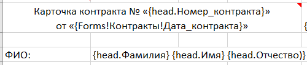
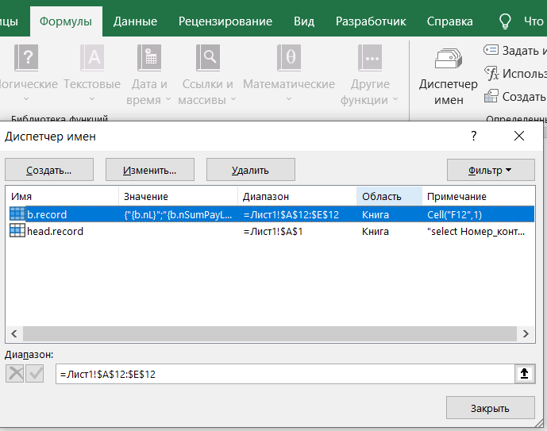
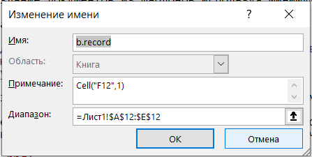
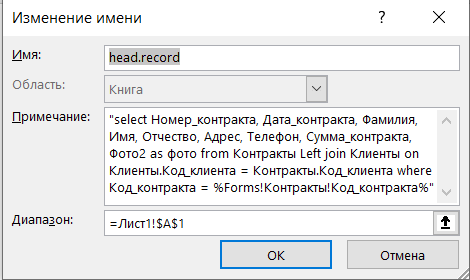
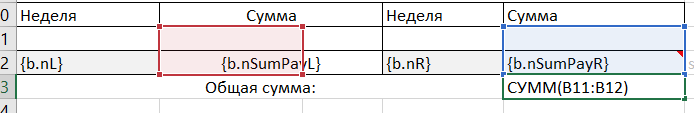

# Установка
Для установки в проект импортируйте файл `KRNReport.bas`. Запустите процедуру `InstallRepSystem`, что бы создать таблицу для хранения шаблонов. Запустите процедуру `InstallReportTemplate`, что бы добавить шаблон в хранилище;

# Генератор отчетов в формате RTF 

Данный инструмент позволяет использовать все возможности MS Word для создания, предварительного просмотра, редактирования и печати отчетов, используя минимум кода. Если Вам понадобилось что то исправлять в основном модуле, то скорее всего Вы делает что то не так.

Как это использовать:

- создайте шаблон отчета
- сохраните его в RTF 
- подготовьте данные в приложении
- выполните функцию [сгенерировать отчет](#runit)

Как это работает:


# Каталог примеров

[Пример "Hello World"](./Example/HelloWorld/HelloWorld.md)

[Пример "быстрый старт"](./Example/QuckStart/QuickStart.md)


# Создание шаблона отчета

Шаблон для отчета - это обычный документ RTF с включением управляющих инструкций-полей. Шаблон может быть создан визуально с помощью Word, OpenOffice или любого другого редактора документов.  Шаблон может включать форматированный текст, таблицы, изображения и т.д. 

В общем случае все поля данных и команды отчета размещаются среди текста отчета, таблиц и других объектов там, где вам это нужно (см. [пример "быстрый старт"](./Example/QuckStart/QuickStart.md)).

Все управляющие слова, переменные и поля данных должны располагаться внутри вычисляемых полей. В MS Word для отображения кодов полей нажмите сочетание клавиш `ALT+F9`, для добавления нового поля `Ctrl + F9`. 

В общем управляющие поля имеют формат `<Команда>(<Аргумент>)`. Если аргументов больше одного, то они отделяются символом `;` или `,`. У некоторых команд может не быть аргументов. Отдельные управляющие конструкции такие как [`IF`](#instruction_if), [`SCAN`](#instruction_scan) - парные и требуют соответствующих закрывающих команд.

Идентификаторы (поля и переменные) не должны содержать символы-разделители `(;,+-*/&^%<>= )`. Однако, если вы хотите использовать имя с пробелами или иными специальными символами, вы можете записать его между символами `[` и `]`, например: `{f(Form1.[Имя поля с пробелами])}`.

В дополнение к полям набора данных в отчете могут использоваться переменные. Для их добавления в локальный контекст используйте функцию [BuildParam](#BuildParam)

<a id="const"></a> В языке RTFReport существует несколько типов констант.

|Тип константы|Описание|
|----|----|
|Строка|Строковые константы определяются как последовательность символов обрамленных парой кавычек `"` или `'` или "\`", внутренние кавычки необходимо удвоить. Например, `"Строковая константа"`, `'кавычки "другого типа" удваивать не нужно'`. Константы часто используются в качестве параметров для пользовательских функций|
|Дата|Константы даты всегда записываются в форме `#dd-mm-yyyy hh24:mi:ss#`, например `#20-07-2002#`
|Числовые|Числовые константы - это числа в десятичной или экспоненциальной форме: `2`, `2.5`, `3E-1`|
Логическое значение|Логические константы равны `True` или `False`
Null значение|Константа `Null`

Кроме того, Вы можете создавать [пользовательские функции](#UsrFnc) и [пользовательские итераторы](#UsrScan)

# <a id="instruction"></a> Инструкции.

1. <a id="instruction_f"></a> `{f(<Выражение>)}` Выводит [выражение](#expresion) в отчете. Опционально вторым параметром можно задать формат. В этом случае перед выводом в отчет значение выражение будет пропущено через функцию `format`. Более подробно с функцией format ознакомьтесь на сайте [Microsoft](https://learn.microsoft.com/ru-ru/office/vba/language/reference/user-interface-help/format-function-visual-basic-for-applications). Пример:

    ```
    {f(a.BoolenValue,';"Согласен";"Не согласен"')}
    {f(a.DateTimeValue,"hh:mi")}
    ```

2. <a id="instruction_scan"></a> `{Scan(Имя_курсора for Текст_запроса)} {EndScan()}`– Открывает новый набор данных и подготавливает его. Если набор будет пуст, то управление передается на позицию идущую за парной инструкцией `EndScan()`. `Имя_курсора` и `Текст_запроса` должны быть выражением или текстовым литералом заключенном в двойные кавычки. 

    Более подробно см. [отдельную часть](#AboutScan)

3. `{next(Имя_курсора)}` - Переместит курсор на одну строку вперед и обновит все переменные. Если весь курсор будет прочитан, то перемнные полей запроса будут очищены (в отличии от обычного завершения по `EndScan`).

4. <a id="instruction_if"></a>`{If(<Выражение>)}… {elif (<Выражение>)}…{else()}…{endif()}` обычный оператор условия.

5. `{skip()} {endskip([skip_lf])}` Вырезают из шаблона часть, если у `endskip` указан параметр `skip_lf`, то он заберет с собой перевод строки

6. `{calc()}` - Вычисляет выражение, значение выражения игнорируются


# <a id="expresion"></a> Выражения

В выражениях может использовать [константы](#const), [локальные переменные](#BuildParam), глобальные переменные, а так же функции. Параметры функций отделяются друг от друга символом `;` или `,`. Арифметические и логические операции те же самые, что и в построителе выражений VBA. Дополнительно доступны операторы `like` и `between`. 


## Встроенные функции

### Функции для работы с переменными

- `rel(ИмяПеременной)` - Возвращает значение локальной переменной имя которой задано выражением `ИмяПеременной`.

- `clr(ИмяПеременной)` - Удаляет локальную переменную из хранилища. Всего может быть задано до 16 значений.

- `set(ИмяПеременной, ЗначениеПеременной)` - Записывает в локальную память переменную с именем заданным выражением `ИмяПеременной`, с значением из выражения `ЗначениеПеременной`.  
**Внимание!** Set здесь имеет иное значение чем в VBA и является аналогом простого присваивания.

- `inc(ИмяПеременной)` - Увеличивает значение локальной переменной на 1. Всего может быть задано до 16 значений.

- `sum(ИмяПеременной, Сумма) - Добавляет к локальное переменной с именем заданным в выражении `ИмяПеременной`, значение из выражения `Сумма`. Всего может быть задано до 8 пар.

- `cts(ИмяПеременной, ТестовоеЗначение)` - Добавляет 1 к локальное переменной с именем заданным в выражении `ИмяПеременной`, если значение из выражения `ТестовоеЗначение` не пустое (Null, Empty, ""). Всего может быть задано до 8 пар.

### Функции для работы с текстом

В дополнение к [стандартным функциям](https://learn.microsoft.com/ru-ru/dotnet/visual-basic/language-reference/functions/string-functions), добавлено несколько дополнительных:

 - <a id="fmt"></a> `fmt(ШаблонныйТекст)` -  Производит замену в тексте подстановочных символов на значения заданные в словаре. Подстановочные символы обрамляются символом `%`. Если нужно вывести символ как есть то его необходимо удвоить `%%`. Например: `fmt("Это просто текст. Значение переменной = %val%. Символ процента = %%")`.
    
    Если первый символ равен `$` далее следует выражение, значение которого нужно вставить в строку в виде SQL литерала. Например: `fmt("Select * from DataTable where dateOp > %$date - 7%")`.
    
    Если первый символ равен `@` далее следует имя фильтра и имя поля к которому нужно применить фильтр. Например: `fmt("Select * from DataTable where 1=1 %@FilterName,DataTable.dateOp%")`. Более подробно смотри раздел [Работа с фильтрами](#GetFilter)
    
    В остальных случаях значение между `%` рассматривается как выражение, значение которого нужно вставить как есть. Дополнительно можно указать [формат](https://learn.microsoft.com/ru-ru/office/vba/language/reference/user-interface-help/format-function-visual-basic-for-applications) для предварительной обработки. Например: `fmt("Текущий год: %Date;'yyyy'%")`.

- `open(ИмяФайла, Кодировка)` - Открывает указанный файл в выбранной кодировке (utf-8, windows-1251) и возвращает его содержимое. Если имя файла начинается с `.\`, то в начало подставляется имя папки, в которой размещена БД. 


### Функции для работы с изображениями

- `open(ИмяФайла)` - Открывает указанный файл и возвращает его содержимое с типом `byte()`. Результат можно использовать для вставки изображения по имени файла.

- `attach(ИмяПоляAttachment[, Маска])` - Извлекает файл из поля с типом Attachment. Функция имеет второй параметр, где указывается маска файла в формате RegExp. По умолчанию используется маска ".+\.(jpg\|jpeg\|png\|emf)$". Если маске соответствует несколько файлов выбирается первый. На данный момент эта единственная функция, которая может работать с полями типа Attachments.

- `rtfimg(РисунокВДвоичномФормате, Ширина, Высота)` - Функция возвращает rtf блок, данные изображения передаются как сырые данные файла byte(). Тип рисунка определяется по его содержимому. Данные можно получить из поля OLE с бинарными данными или функцией open. Вторым и третьим параметром передается соответственно ширина и высота рисунка в миллиметрах

### Встроенные функции для работы с штрихкодом.

Штрихкоды формируются как векторное изображение, поэтому на компьютере клиента не нужно устанавливать специальные шрифты

- `ean13(ЗначениеШтрихКода, Ширина, Высота)` - Вставляет в документ картинку с штрихкодом в формате [EAN13](https://ru.wikipedia.org/wiki/European_Article_Number). Штрих код должен быть не больше 13 цифр, при этом крайняя правая цифра - это контрольная сумма.

- `code128(Текст, Ширина, Высота)` - Вставляет в документ картинку с штрихкодом в формате [CODE128](https://ru.wikipedia.org/wiki/Code_128). Штрих код должен состоять только из букв английского алфавита и цифр. Контрольное число добавляется автоматически в конец.

- `qrcode(Текст, Ширина, Высота)` - Вставляет в документ картинку c [QR кодом](https://ru.wikipedia.org/wiki/QR-код) от текста. Для поддержки данной функции необходимо дополнительно добавить модуль [`mdQRCodegen.bas`](./src/mdQRCodegen.bas). Модуль основан на [генераторе QR кода](https://github.com/wqweto/VbQRCodegen)

## <a id="UsrFnc"></a>Пользовательские функции

Если Функция не будет найдена в предопределенном наборе, будет предпринята попытка вызвать пользовательскую.

Пользовательская функция имеет следующий интерфейс


```vb
Public function MyFnс(pParamList, aArg)
 '#param pParamList – Словарь с окружением, содержит все переменные и объекты текущего шаблона. Вызови pParamList("a.b") что бы получить значение поля b курсора a
 '#param aArg – массив с аргументами. За раз можно передать не более 16 параметров
  On Error GoTo OnError:

 'Здесь Ваш код 
  MyFnс = aArg(0) + 1

  Exit Function
OnError:
  Dim errNumber, errSource, errDescription
  errNumber = Err.Number: errSource = Err.Source: errDescription = Err.Description
  On Error GoTo 0
  Err.Number = errNumber: Err.Source = errSource: Err.Description = errDescription
End function
```

Обратите внимание на обработку ошибок. Такой блок должен быть в каждой пользовательской функции, чтобы можно было корректно обработать ошибку выше. 

В отличии от нативных функций, пользовательские функции имеют доступ к контексту переменных. Если функция чистая, т.е. ее результат зависит только от входящих параметров и не оказывает влияния на контекст переменных, то рекомендуется использовать нативные функции.  

## Нативные функции

Встроенные функции VBA (нативные) доступные из построителя выражений SQL доступны под теми же именами. Нативные функции вызываются если имя функции не найдено в списке встроенных и не найдена пользовательская функция.

# <a id="AboutIf"></a>Оператор IF - ENDIF

Оператор имеет следующий формат

```
{if(<boolean value>)}
...
{elif(<boolean value>)}
...
{elif(<boolean value>)}
...
{else()}
...
{endif([skip_lf])}
```
где `<boolean value>` выражение возвращающее логическое значение. Может содержать переменные, поля и фнкции.

`endif` может содержать необязательный параметр `skip_lf`, при указании которого символ окончания параграфа после `endif` будет пропущен и не будет выведен в отчет. Символ окончания параграфа всегда пропускается после `if` и `elif`.


# <a id="AboutScan"></a> Конструкция Scan

Все записи набора данных могут быть вставлены в документ в виде строк таблицы или в любой свободной форме. Для этого используйте ключевые слова `{Scan(ИмяКурсора for ...)}` и `{Endscan()}`. Внутри цикла `scan`-`endscan` может быть расположен текстовый блок с полями данных, переменными и константами, например:


Открывает курсор с именем `а`, считывает результаты запроса и укладывает результат в переменную с именем `a.Фамилия`, `a.Имя` ... 

Строки со словами `Scan`, `Endscan` исключаются из итогового документа.

Полный формат блока сканирования:

```
{scan([NewPage ]Имя_Курсора for ...)}
...
{scanentry()}
...
{scanfooter()}
...
{endscan()}
```
Имя курсора будет использовано как префикс к результатам, полученным в ходе выборки. 

Опция `NewPage` заставляет начинать каждую запись сканируемого набора данных (кроме первой) с новой страницы.

`Scan` по умолчанию работает с наборами данных БД. Так же поддерживаются пользовательские итераторы, для этого после ключевого слова `for` (обязательно должно быть обрамлено пробелами, имя_курсора не должно содержать в себе последовательность символов ` for `) укажите ключевое слово using и далее класс итератора (см. [итераторы определяемые в программе](#UsrScan)) дальнейший формат записи определяется итератором.

Блоки `scanentry` и `scanfooter` не обязательные. 


Блок отчета между ключевыми словами `scan` и `scanentry` будет выведен вместе с первой запись. Обратите внимание на то, что генератор отчетов пропустит весь блок сканирования, если в отсканированном наборе данных нет записей.


Блок отчета между ключевыми словами `scanfooter` и `endscan` будет выведен вместе с последней строкой, что полезно для вывода колонтитула или итогов. Если в наборе данных нет записей то блок будет пропущен.

Блоки `scanentry` и `scanfooter` могут использоваться одновременно.  

ПРИМЕЧАНИЕ: Необходимо ввести ключевые слова `{scan(...)}`, `{scanentry()}` и `{endscan()}` с одинаковыми атрибутами формата. Это гарантирует, что атрибуты формата внутри блока scan-endscan будут корректными в выходном документе.

Если вы используете опцию `NewPage` и таблицу сразу после ключевого слова `Scan` в шаблоне отчета, имейте в виду, что в документе RTF перед таблицей должен быть хотя бы один абзац (пустая строка), в противном случае редактор RTF, такой как MS Word, игнорирует элемент управления "новая страница".

При редактировании шаблона отчета размещайте ключевые слова `{scan(...)}`, `{endscan()}` вне таблицы или в той же ячейке, чтобы предотвратить искажение структуры таблицы RTF.

## <a id="iterator_type"></a>  Итератор по набору данных

По умолчанию используется итератор по набору данных, если после ключевого слов `for` не указано ключевое слово `using`. 

Данный класс итератора ожидает после `for` выражение, возвращающее текст содержащий метод получения набора данных. Это может быть:

- Имя таблицы. В этом случае будет просканирована вся таблица
- имя запроса. В этом случае так же будет просканирован весь запрос 
- Ссылка на набор данных на форме. Ссылка должна начинаться с специального символа `@` далее имя формы и при наличии имя подчиненной формы, отделенной символом `.`. Например, `@Контракты.подформаПлатежи`. В этом случае набор данных клонируется и сканируется начиная с первой записи.
- Текст запроса. Начинается с `select`. В тексте запроса можно обращаться к переменным окружения, для этого вставьте переменную обрамив ее символами %. Более подробно см. описание функции [fmt](#fmt)

**Пример:**
```
{scan("a" for "select * from MyTable where id = %id%")}
```

Такой подход необходим для создания отчетов с архитектурой Master-Detail 
 
```
{scan("Parent" for "select * from MyTable where id = %id%")}{scan("Child" for "select * from MyChildTable where idParent = %Parent.id%")}{endScan()}{endScan()}
```

для некоторых типов возможно указать формат: `%Имя_переменной; Формат%`

для создания критерия отбора необходимо использовать следующую подстановку `%Имя_поля_Фильтра; stdf:Имя_поля%` что означает примени параметр `Имя_поля_Фильтра` к полю `Имя_поля`. Для добавления параметра в окружение можно использовать функцию `BuildParam` совместно с [`GetFilter`](#GetFilter).

Дополнительно создаются переменные `Имя_Курсора.EOF` возвращающие `True` на последней строке запроса и `Имя_Курсора.rownum` содержащей номер текущей строки. После `endScan()` значения переменных не очищается и их можно использовать. Явного запрета на переиспользование имени курсора во вложенном цикле - нет, но вложенный цикл может затереть данные родительского цикла.

## Числовой итератор "NumberIteration"

Представляет собой аналог цикла `for` в VBA. Строка инициализации имеет следующий синтаксис: `from НачальноеЗначение to КонечноеЗначение step Шаг`. Часть Step необязательная.

```
{scan("i" for using numberIteration from 1 to 10 step 3))}
{f(i)}) - строка
{endscan()}
```

## <a id="UsrScan"></a> Итераторы определяемые в программе

Для использования пользовательских итераторов укажите их класс. Синтаксис оставшейся части определён в самом классе.

Для создания собственного итератора необходимо создать реализацию 4-х функций:

 - `Public Sub <ИмяКласса>_New(ByRef Container, ByVal sAlias, ByVal sParam, ByRef pDic)`

    Вызывается при старте цикла, передаются следующие параметры цикла: 

    1. Ссылка на словарь в котором можно хранить текущее состояние итератора. При создании в словаре сразу будет находится имя курсора (alias) и название класса итератора (name);
    2. Имя_курсора;
    3. Оставшаяся часть строки после ключевого слова `using`;

        Для разбора строки можно использовать следующие функции (i - номер текущей позиции разбираемого символа):

        - `GetPartFromFormula(sParam, i)` - Используется для получения литерала
        - `GetExpression(sParam, pDic, i)` - Разбирает в строке выражение и возвращает его значение

    4. Ссылка на локальный контекст.    

 - `Public Function <ИмяКласса>_EOF(ByRef Container, ByRef pDic)`

    Вызывается перед выводом каждой строки. Функция должна вернуть True если есть данные для выборки и false во всех остальных случаях

 - `Public Function <ИмяКласса>_Fetch(ByRef Container, ByRef pDic)`

    Функция должна перенести текущее значение в локальный контекст `pDic` при этом что бы не конфликтовать с другими итераторами необходимо использовать значение `Container("alias")`. Функция должна вернуть True, если операция выполнена успешно и False в противном случае.

 - `Public Sub <ИмяКласса>_Close(ByRef Container, ByRef pDic)`

    Функция вызывается при закрытии цикла. Здесь должен располагаться код с очисткой памяти.

Во всех 4-х функциях обработка ошибок должна производиться так же как и в [пользовательских функциях](#UsrFnc)

Пример реализации класса numberIteration см. в основном модуле `KRNReport`.


# <a id="print_report"></a> Пример запуска отчета

Отчет строится процедурой `PrintReport`. Параметры: 

- `vReport` - шаблон отчета, это может быть абсолютная или относительная ссылка на файл шаблона. Так же можно указать имя или id скомпилированного отчета, который хранится в таблице t_rep.
- `dic` - Необязательный параметр. Контекст с переменными. Если данный параметр опустить, то будет использоваться глобальный контекст, который сохраняет свои значения между запусками. 
- `sFile` - Необязательный параметр. Имя выходного файла.
- `bPrint` - Необязательный параметр. Распечатать файл после формирования.
- `PluginList` - Список плагинов, разделенных запятой. Плагины обычно добавляют новые функции в шаблоны.

Все переменные хранятся в объекте типа Dictionary поэтому его необходимо создать, а после завершения операции уничтожить. Если объект не уничтожить, то переменные, созданные в первом отчете будут доступны и в последующих.

```vb
dim dic
Set dic = CreateObject("Scripting.Dictionary")
```
<a id="BuildParam"></a> Альтернативный вариант создания окружения это через функцию `BuildParam`. Первым параметром необходимо указать переменную с контекстом или `Nothing`, если нужно создать новый контекст. Дальше следует набор пар `Имя_параметра, Значение`. Количество не ограниченно.

```vb
dim dic
set dic = BuildParam(Nothing, "ID", 1, "Date", date() - 1)
```

<a id="runit"></a>Запуск формирования отчета

Запускает отчет с кодом 1

```vb
  PrintReport 1, dic 
  Set dic = Nothing
```

Запускает отчет из файла Template.rtf с поддержкой функций плагина **PlantFormat**

```vb
  PrintReport "Template.rtf", PluginList := "PlantFormat" 
```


# Дополнительные модули

Дополнительные модули распространяются как файлы .bas. Для унификации вызовов в каждом модуле плагина должна быть функция:

```vb
Public Function <Имя_плагина>_InitPlugin(Optional ByRef pParamList As Object)
  Dim sExtension
  sExtension = LCase(pParamList("@SYS_Extension"))
  If sExtension = "rtf" Or sExtension = "docx" Then
    KRNReport.AddSpecialFunction pParamList, "<реальное имя функции>", "<имя функции в генераторе>"    
  ElseIf sExtension = "xls" Or sExtension = "xlsx" Or sExtension = "xlsm" Then
    KRNReport.AddSpecialFunction pParamList, "<реальное имя функции>", "<имя функции в генераторе>"    
  End If
End Function
```

Так как вставка тех или иных элементов отличается принципиально, то и реализация функций будет различной.

Для Excel иногда невозможно сразу выполнить действие функции до момента пока не будет произведена реальная вставка данных в ячейку. В этом случае можно использовать отложенную пост обработку.

```vb
ExcelAddCellFormatter <Словарь контекста>, "<Имя процедуры обработчика>", <Дополнительные параметры для обратного вызова> 
```

Шаблон процедуры обратного вызова

```
Public Sub <Имя процедуры обработчика>(pRange, ParamList, pUserData)
'#param pRange - ссылка на изменяемую ячейку, может быть объединенной
'#param ParamList - ссылка на текущий контекст 
'#param pUserData - дополнительные данные переданные в ExcelAddCellFormatter
  On error goto onError

  'Действия по дополнительной обработке

  Exit Sub
OnError:
  Dim errNumber, errSource, errDescription: errNumber = Err.Number: errSource = Err.Source: errDescription = Err.Description
  On Error GoTo 0
  Err.Number = errNumber: Err.Source = errSource: Err.Description = errDescription

End Sub

```


# <a id="Excel"></a> Шаблонизатор для электронных таблиц Excel

Основной идеей данного модуля - это создание документов из шаблонов используя минимум кода. Вся настройка будущего вида документа создается непосредственно в редакторе Excel.

Что бы воспользоваться возможностями шаблонизатора добавьте в проект модули:

- `KRNReport.bas` - базовый модуль, содержащий так же шаблонизатор для RTF документов;
- `KRNReportExcel.bas` - модуль отвечающий, за шаблонизатор документов Excel;
- `mdQRCodegen.bas` - опциональный модуль, если в документ нужно внедрять QR код.

Основными структурными блоками шаблонизатора являются подстановочные поля и итерируемые по наборам данных строки.

## Подстановочные поля

Подстановочные поля указываются непосредственно в ячейках. Для выделения их на фоне остального текста используются обрамляющие фигурные скобки `{}`.  
Внутри фигурных скобок нужно записать выражение (формулу) для получение значение. Вычисленное выражение будет вставлено вместо поля. 

Для вывода переменных из текущего итератора, необходимо указать имя набора данных затем через точку имя поля. Если имена содержат пробелы то их необходимо заключить в квадратные скобки.

Если подстановочное поле единственное и до/после него нет текста, то в ячейку вставляется непосредственно значение поля без преобразований. В противном случае части объединяются по их строковому представлению.



Если нужно в тексте использовать фигурную скобку, то экранируем ее символом `\`. Сам символ `\` если нужно воспринимать как символ, то его удваиваем. 
 
В выражения можно использовать как переменные из контекста так и непосредственно данные с полей формы. Так же в выражениях можно использовать функции VBA, плюс несколько специальных функций предоставляемых шаблонизатором. В дополнение к обычным функциям можно создавать дополнительные пользовательские.

## Итерируемые строки

Итерируемые строки - это строки шаблона которые будут повторяться для каждой строки из набора данных. Строки добавляются путем копирования оригинала, поэтому сохраняется форматирование.

Наборами данных могут выступать:

- SQL запросы,
- Запросы как объекты Access,
- Источники данных для форм

Диапазон итерируемых строк должен иметь специальное имя, к внутреннему имени добавляется окончание `.record`, например `ИмяНабораДанных.record`.

Для задания имени на панели инструментов выберите вкладку "Формулы", затем выберите пункт "Диспетчер имен". Добавьте новый именованный диапазон.



В поле "Имя" задайте имя набора данных, добавив специальный маркер `.record`.

В поле "Диапазон" укажите диапазон строк, который будет копироваться и заполняться.  
Рекомендуется выделять только видимую часть диапазона, а не всю строку целиком, так как это может сказаться на скорости формирования отчета.

В поле "Примечание" укажите выражение как получить, данные.  
Длина поля ограничена 255 символами, если необходимо ввести источник длиннее, то можно воспользоваться функцией `cell`, оно возвращает содержимое ячейки по указанному адресу, а если передать что угодно вторым параметром, то после прочтения содержимое ячейки будет очищено.

 

Более подробно про источники данных смотри в разделе "[Типы итераторов](#iterator_type)". 

После обработки всех строк набора данных, связанные переменные из контекста не удаляются и могут использоваться повторно. Данный подход можно применять для заполнения шапки отчета (см пример).

Так как в Excel несколько иной подход в построении шаблона в отличии от RTF шаблонизатора, то имеются отличия в возможностях:

- Не доступны конструкции шапки (scanentry) и подвала (scanfooter) итераторов;
- Итераторы не могут быть вложенными
- Не доступны условные блоки if ... then
- Для вставки изображений необходимо использовать функцию `img` вместо `rtfimg`. Если не указывать размер изображения (Параметр не передан или передано `Empty`), то оно будет вписываться в ячейку, в которой использовалась данная функция.

Сразу из коробки доступен вывод штрих кода в формате 

 - CODE128
 - EAN13
 - QRCode (если в проект включен модуль mdQRCodegen)
 
Формирование документа унифицировано (более подробно смотри [Пример запуска отчета](#print_report))

```vb
Private Sub ExcelPrint_Click()
  PrintReport ".\Контракт2.xlsx"
End Sub
```

## Особенности пользовательских функций

Архитектурно функции должны строиться по тем же принципам, что и в случае с RTF шаблонизатором. 

Excel шаблонизатор добавляет в контекст текущие объекты с которыми ведется работа. Изменять ссылки на объекты нельзя, так как это может нарушить процесс построения отчета.

- `pParamList("@SYS_CurrentCell")` - ссылка на ячейку которая заполняется в текущий момент

- `pParamList("@SYS_CurrentRow")` - ссылка на диапазон текущей заполняемой строки

- `pParamList("@@SYS_PrevRecordset")` - ссылка на предыдущий заполненный диапазон строк

- `pParamList("@@@SYS_CurrentSheet")` - ссылка на текущую заполняемую страницу

Данные переменные можно использовать для дополнительного форматирования, создания дополнительных объектов. При этом нельзя добавлять/удалять строки или столбцы, так как это может привести к некорректному заполнению шаблона. 

## Трюки с заполнением шаблона

Так как шаблон заполняется путем вставки скопированных строк, то к итерируемым строкам можно применить диапазонные функции. Для этого вставьте между шапкой и основными строками пустую строку, затем включите эту строку в формулу. После чего скройте эту дополнительную строку




# Модуль плагина "PlantFormat"

## Функция `ef` 

**EvalFormat** - может обрабатывать выражения в тексте.

Извлекает из текста части заключенные в двойные фигурные скобки, содержимое рассматривается как выражение, которое вычисляется и его значение заменяет формулу.

Например текст `2*2={{2*2}}` будет преобразован в `2*2=4`

## Функция `pf`

**PlantFormat** Функция воспринимает отдельные конструкции как указания на форматирование и принимает данное форматирование в документе

Служебные символы перекликаются с разметкой MarkDown

Используемые конструкты: `$_подстрочный$`, `$^надстрочный$`, `$__подчеркнутый$`, `$*курсив$`, `$**полужирный$`, `$***полужирный курсив$`, `$~зачеркнутый$`, `$#00ff00 цветной текст$` (только в Excel), цвет задается в формате RGB

Если нужно использовать символ `$` с следующим за ним одним из символов `_^*~`, то знак доллара нужно экранировать символом `\`.

Внутри форматируемого текста символы `\` и `$` - служебные, и для использования по своему естественному написанию должны экранироваться `\\` и `\$` соответственно. Например: `2$$*2шт=$~5\$$`, преобразуется в текст 2$*2шт=~~5$~~
  
Форматы можно вкладывать друг в друга. Например: `$$ - $_$__$#FF0000Подстрочный подчеркнутый и красный$$$`
